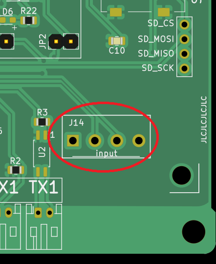
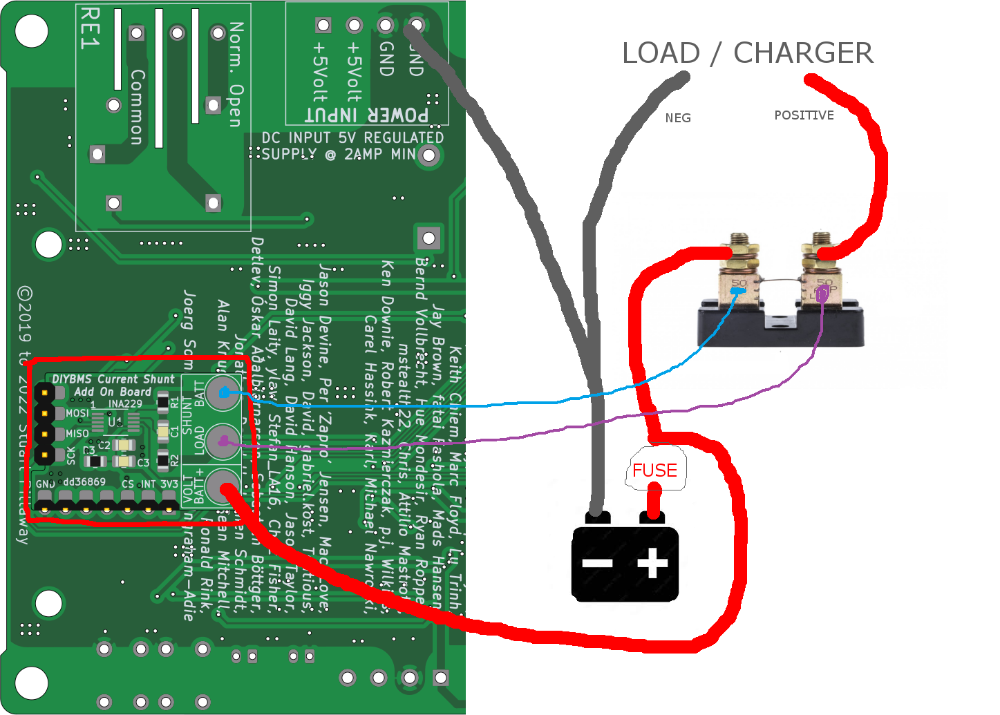

# Installation Instructions - DIYBMS Current Shunt Add On Board

## Steps

* Fully construct/populate/solder the add-on PCB board with the correct components.
* Determine which DIYBMS Controller PCB version you have from the images below.
* Solder the add-on board onto the *BOTTOM* of the controller PCB.
* Solder the 4 pin connector first.  If a female socket is already installed, either temporarly remove it and resolder, or attempt to heat the pins up and nudge the add-on board into the molten solder.
* Follow remaining instructions from the images below.

## Controller PCB version 4.4 and 4.5 - J14 Horizontal 7 pin

* Identify if you have this board by locating J14 which should have 7 pins and is horizontal.
* Silk screen will mention V4.4 or V4.5
* Note some V4.4 boards have a 5 pin vertical J14 connector (see below)
* Boards built after May 2022
* Add-on board will fully align to this PCB
* Solder add-on to rear of controller PCB. Attach to 4 pin header first
* Use a male 7 pin 2.54mm header to solder remaining pins to J14

## Controller PCB version 4.4 - J14 Vertical 5 pin

* Identify if you have this board by locating J14 which should have 5 pins and is vertical.
* Silk screen will mention V4.4
* Board will have SW1 and SW2 on silkscreen for push button switches
* Add-on board will NOT fully align to this PCB - additional wiring required
* Solder add-on to rear of controller PCB. Attach to 4 pin header first
* Unfortunately add-on board overlaps some pins on J14 connector. Place some insulation tape onto the back of the controller PCB, covering the overlapped J14 holes.
* Connect wires between J14 and the add-on board as per picture
* Connect the GND wire

## Controller PCB version 4.2 - J14 Horizontal 4 pin

* Identify if you have this board by locating J14 which should have 4 pins and is horizontal.
* Silk screen will mention V4.2 - possibly dated "May 2021"
* TX2/RX2 are not fitted/visible
* Add-on board will NOT fully align to this PCB - additional wiring required
* Solder add-on to rear of controller PCB. Attach to 4 pin header first
* Connect wires between J14 and the add-on board as per picture

## Controller PCB version 4.2 - J14 missing

* TX2/RX2 connectors are fitted/visible in lower right hand corner
* J14 is missing
* Silk screen will mention V4.2
* Dated before May 2021
* Add-on board will NOT fullly align to this PCB - additional wiring required
* Unsolder/remove parts marked TX2/RX2, R26, R7 and optoisolator near TX2
* Solder add-on to rear of controller PCB. Attach to 4 pin header first
* Solder +3.3V and GND wires to the rear of J6 (red and black on picture)
* Solder ESP32 pin 6, GPIO35 (purple wire on picture) to "INT"
* Solder ESP32 pin 8, GPIO33 (yellow wire on picture) to "CS"

# Connection of Add-On board to SHUNT and BATTERY

*NOTE* Using the Add-On board means that the battery negative and the controller are electrically connected to each other via the ground/negative connections.  If you require an *ISOLATED* electrical connection, use the RS485 based external current monitor shunt board.

You will require a regulated 2amp step down transformer to drop the battery voltage to +5V, before connecting to the controller PCB.

Use of mains powered USB or 5V regulators may cause ground loop issues, and potential damage to the controller.

For more information on ground isolation, see https://en.wikipedia.org/wiki/Isolated_ground

*DO NOT CONNECT BATTERY POSITIVE + TO THE CONTROLLER +5V INPUT - YOU WILL DESTROY THE CONTROLLER PCB!*

## Connections
* Solder wire to "VOLT BATT+" terminal and connect to a FUSED battery positive
* Connect the battery negative to the controller "GND" connection
* Connect the FUSED positive positive to the SHUNT resistor, and the other terminal to the load/charger
* Connect the "SHUNT BATT" terminal to the SHUNT resistor, on battery side
* Connect the "SHUNT LOAD" to the other SHUNT resistor terminal

The shunt resistor will normally have seperate (Kelvin) terminals for the sensor wires, and nut/bolt connections for the power.

You may find it easier to route the cables to the front of the PCB through the hole under the TFT screen.  Hot glue may be useful to hold wires in place/stress relief.

Only lightweight wires are required for the connections to the add-on board, 24AWG (0.25mm) or similar should be okay.  Twist shunt sensor cables to help reduce interference.

