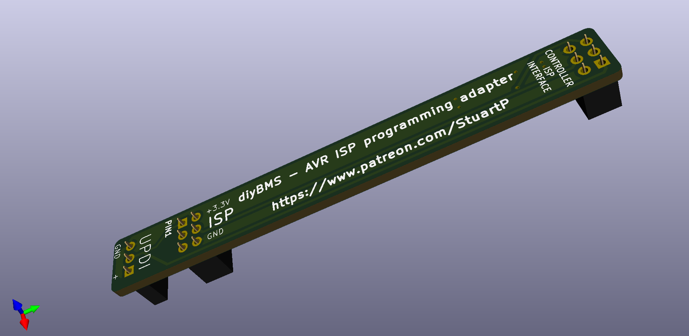

# Programming Adapter AVR/ISP

Note this is a simple PCB which connects the 6 pin ISP header to a 6 pin ISP header (straight through)

It is often simpler to use a ribbon cable and two 6 pin plugs!

