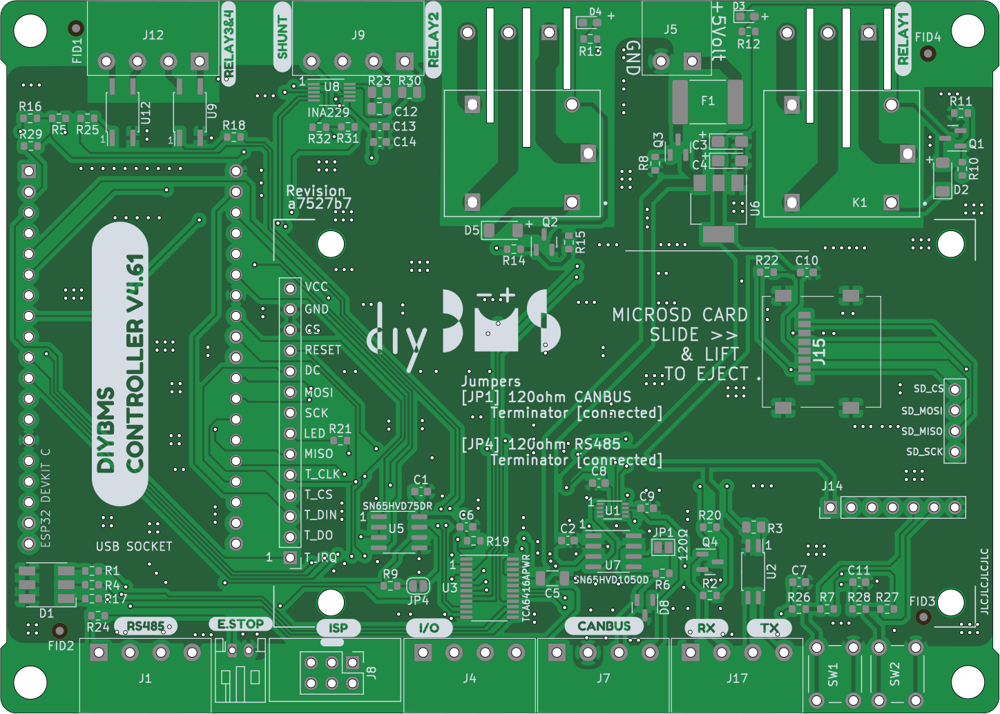
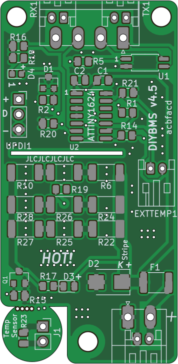
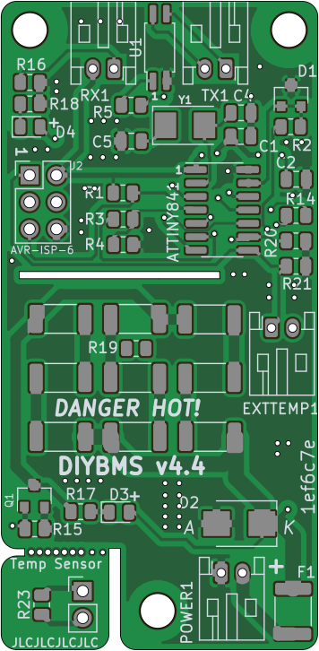

# diyBMS v4

Version 4 of the diyBMS

Do it yourself battery management system for Lithium ion battery packs/cells

More discussion [Open Energy Monitor Forum](https://community.openenergymonitor.org/c/hardware/diybms/53)

If you are looking for version 3 (obsolete) of this project take a look [here](https://github.com/stuartpittaway/diyBMS)

THIS REPOSITORY CONTAINS THE HARDWARE FOR THE SYSTEM

# Videos on how to use and build

[YouTube playlist](https://youtube.com/playlist?list=PLHhwQCDPuRcZW3u0jJucsiCCsUbNbMy-c) for DIYBMS videos

[Building & ordering the PCB from JLCPCB](https://youtu.be/E1OS0ZOmOT8)

If you order a PCB, please use my affiliate link to help support this project [JLCPCB](https://jlcpcb.com/RSZ)

# Support

If you find the BMS useful, please consider buying me a beer, check out Patron for more information

https://patreon.com/StuartP

# HARDWARE

This repository contains the hardware designs, generally in KiCad format.  Unless you are changing the design, you don't need to use/install KiCad, just use the precompiled files.

The folder structure in the repository contains:

## Controller Designs
* ControllerCircuit - ESP32 controller board (newest design)
* ESP8266ControllerCircuit - [legacy] the circuit board for the legacy ESP8266 based controller

## Modules for Controller
* ModuleV490-AllInOne - Latest multi cell monitoring solution, recommended for 8 to 16S cell configurations.  No balancing, requires ModuleV490-PassiveBal passive balancer daughterboard if this is needed.
* ModuleV490-PassiveBal - daughter board for the V490 multi-cell monitoring solution, provides 200mA per cell balance current, heatsink and fan control.
* ModuleV450 - the latest SINGLE module design, using ATTINY1624 chip. Recommended for both hand soldering or mass production
* ModuleV440 - [legacy] the module circuit board V4.40, final board using ATTINY841 chip
* ModuleV400 - [legacy] the module circuit board V4.00, designed for easier hand soldering (larger parts)
* ModuleV421 - [legacy] the module circuit board V4.21, designed for mass production using JLCPCB assembly service

If you use this coupon code when you place a JLCPCB order

JLC-Stuart

and this link

https://jlcpcb.com/RSZ

you will get a discount and I get a very small amount of credit for every 30 orders, which helps to support the cost of prototyping new designs and adding new features.

### ESP32 Controller 

The latest version of the controller uses an ESP32 and supports CANBUS, RS485, SD CARD logging, relays, SSR outputs, multiple inputs, AVR programmer and much more.

Although the hardware is complete, not all features are usable from the software, this will be developed and improved over time to make use of the hardware.

[Bill of Materials](./ControllerCircuit/ComponentListBOM.md)

### Module V4.50

The latest version of the module hardware uses the ATTINY1624 chip - part of the tinyAVR2 range.

This board requires an UPDI programmer/device - see the instructions in the code repository for how to program the boards once built.

The parts are no smaller than 0805 size (about 2mm!) which is probably the smallest size you want to attempt to hand solder.

Specifications are similar to the V4.40 board.

### Module V4.40

V4.40 is the last board to use the ATTINY841 chip - V4.50 is the newest design if you are starting fresh.

In addition, the hardware has a higher balance current, fuse and TVS diode to help with voltage spikes.  
Most importantly, an external crystal has been added to the micro controller (attiny841) which means the device is more reliable in low voltage situations.

The balance current for V4.40 modules is as follows:
* 1.27A at 4.2V (5.35W)
* 1.21A at 4.0V (4.84W)
* 1.13A at 3.75V (4.26W)

The module is physically larger than previous modules, this aids heat dispersal but also features a "snap off" external temperature daughter board for use in cell temperature monitoring.

You will also need to order [these parts](./ModuleV440/HandAssemblyParts.md)

# CODE/SOFTWARE

Software and code for the modules and controller can now be found in a seperate repo

For the latest controller (ESP32)
[diyBMSv4ESP32](https://github.com/stuartpittaway/diyBMSv4ESP32)

For the legacy controller (ESP8266)
[diyBMSv4Code](https://github.com/stuartpittaway/diyBMSv4Code)

# WARNING

This is a DIY product/solution so don’t use this for safety critical systems or in any situation where there could be a risk to life.  

There is no warranty, it may not work as expected or at all.

The use of this project is done so entirely at your own risk.  It may involve electrical voltages which could kill - if in doubt, seek help.

The use of this project may not be compliant with local laws or regulations - if in doubt, seek help.

# License

This work is licensed under a Creative Commons Attribution-NonCommercial-ShareAlike 2.0 UK: England & Wales License.

https://creativecommons.org/licenses/by-nc-sa/2.0/uk/

You are free to:
* Share — copy and redistribute the material in any medium or format
* Adapt — remix, transform, and build upon the material
The licensor cannot revoke these freedoms as long as you follow the license terms.

Under the following terms:
* Attribution — You must give appropriate credit, provide a link to the license, and indicate if changes were made. You may do so in any reasonable manner, but not in any way that suggests the licensor endorses you or your use.
* Non-Commercial — You may not use the material for commercial purposes.
* ShareAlike — If you remix, transform, or build upon the material, you must distribute your contributions under the same license as the original.
* No additional restrictions — You may not apply legal terms or technological measures that legally restrict others from doing anything the license permits.

Notices:
You do not have to comply with the license for elements of the material in the public domain or where your use is permitted by an applicable exception or limitation.

No warranties are given. The license may not give you all of the permissions necessary for your intended use. For example, other rights such as publicity, privacy, or moral rights may limit how you use the material.
